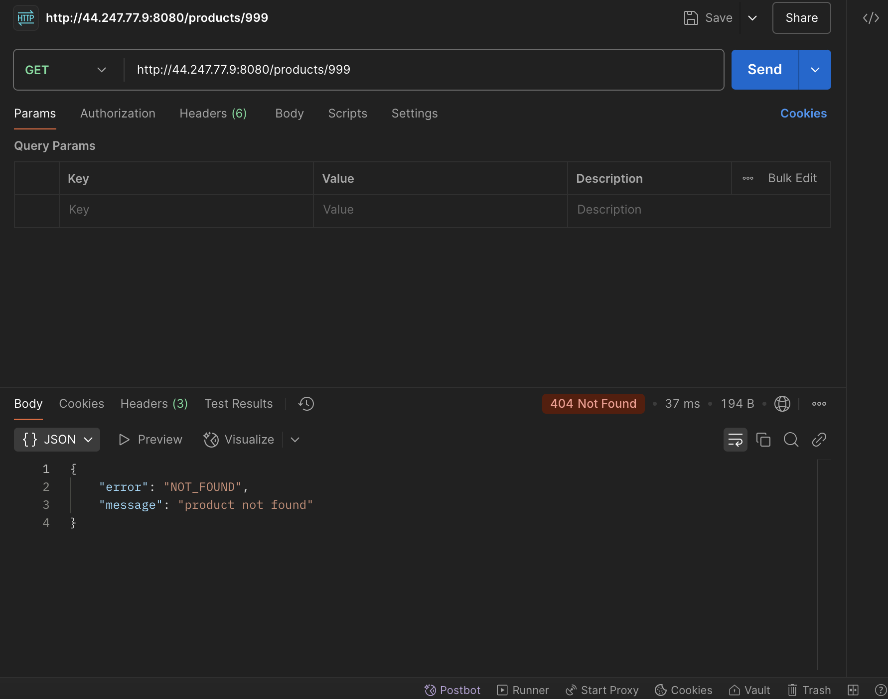
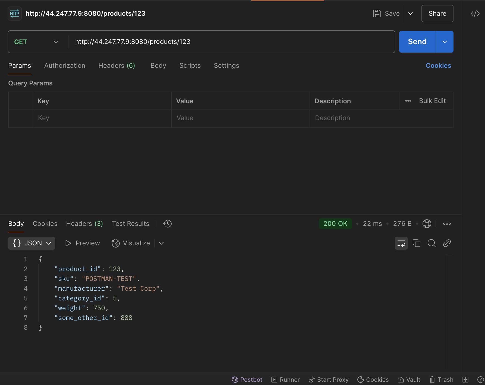

# Product API - CS6650 Assignment 5

## Deployment Instructions

### Prerequisites
- AWS Academy Learner Lab access
- Terraform installed locally
- Docker Desktop running
- AWS CLI configured

### Deploy to AWS ECS

1. **Configure AWS credentials**
   ```bash
   # Copy credentials from AWS Academy to ~/.aws/credentials
   mkdir -p ~/.aws
   nano ~/.aws/credentials
   # Paste the credentials from AWS Details
   ```

2. **Initialize and deploy infrastructure**
   ```bash
   cd terraform
   terraform init
   terraform apply
   # Type 'yes' when prompted
   ```

3. **Get the public IP**
   ```bash
   TASK_ARN=$(aws ecs list-tasks --cluster product-service-cluster --region us-west-2 --query 'taskArns[0]' --output text)
   ENI_ID=$(aws ecs describe-tasks --cluster product-service-cluster --tasks $TASK_ARN --region us-west-2 --query 'tasks[0].attachments[0].details[?name==`networkInterfaceId`].value' --output text)
   PUBLIC_IP=$(aws ec2 describe-network-interfaces --network-interface-ids $ENI_ID --region us-west-2 --query 'NetworkInterfaces[0].Association.PublicIp' --output text)
   echo "API URL: http://$PUBLIC_IP:8080"
   ```

## API Examples

**Postman Collection:** For easy testing, import `res/Product API.postman_collection.json` into Postman.

**Setup:** After importing, update the collection variable:
1. Right-click the collection → Edit → Variables tab
2. Update `base_url` with your ECS task's public IP or use `http://localhost:8080` for local testing

### Test all response codes

**404 - Product Not Found**
```bash
curl -X GET http://44.247.77.9:8080/products/999
# Response: {"error":"NOT_FOUND","message":"product not found"}
```


**400 - Invalid Product ID**
```bash
curl -X GET http://44.247.77.9:8080/products/abc
# Response: {"message":"invalid product ID format"}
```


**204 - Create Product (No Content)**
```bash
curl -X POST http://44.247.77.9:8080/products/123/details \
  -H "Content-Type: application/json" \
  -d '{
    "product_id": 123,
    "sku": "AWS-TEST-001",
    "manufacturer": "Cloud Corp",
    "category_id": 5,
    "weight": 750,
    "some_other_id": 888
  }'
# Response: (empty, 204 status)
```


**200 - Get Product**
```bash
curl -X GET http://44.247.77.9:8080/products/123
# Response: {"product_id":123,"sku":"AWS-TEST-001",...}
```


## Project Structure

```
├── src/
│   ├── main.go          # Product API implementation
│   ├── Dockerfile       # Multi-stage container build
│   ├── go.mod           # Go module dependencies
│   └── go.sum           # Dependency checksums
├── terraform/
│   ├── main.tf          # Main infrastructure orchestration
│   ├── variables.tf     # Configurable parameters
│   ├── provider.tf      # AWS and Docker providers
│   ├── modules/
│   │   ├── ecr/         # Container registry
│   │   ├── ecs/         # Container orchestration
│   │   ├── network/     # VPC and security groups
│   │   └── logging/     # CloudWatch logs
│   └── .gitignore       # Excludes tfstate and secrets
├── res/
│   ├── screenshots/
│   │   ├── go_run_test.png                      # Local Go testing
│   │   ├── docker_container_test.png            # Docker testing
│   │   ├── aws_deployed_api_test.png            # AWS deployment testing
│   │   ├── postman_200_get_product_success.png  # 200 OK response
│   │   ├── postman_204_product_created.png      # 204 No Content response
│   │   ├── postman_400_invalid_product_id.png   # 400 Bad Request response
│   │   ├── postman_404_product_not_found.png    # 404 Not Found response
│   │   ├── locust_statistics_summary.png        # Load test statistics
│   │   └── locust_performance_charts.png        # Load test charts
│   ├── Product API.postman_collection.json      # Postman collection
│   └── api.yaml                                  # OpenAPI specification
├── locustfile.py        # Load testing script
└── README.md            # Project documentation
```

## Load Testing Results

Tested with 10 concurrent users, 2 users/second spawn rate, 3-minute duration.

**Performance Metrics:**
- **Requests/Second:** 4.9 RPS sustained
- **Average Response Time:** 15ms (both GET and POST)
- **95th Percentile:** 16-17ms
- **Failure Rate:** 64% (primarily 404s for non-existent products)

**Analysis:**
- Response times are consistently fast (~15ms) due to in-memory HashMap storage providing O(1) lookups
- GET and POST operations have similar performance because both are simple map operations
- High failure rate is expected: random product IDs (1-1000) mostly don't exist, resulting in valid 404 responses
- System maintains stable throughput under concurrent load

## Architecture & Design Decisions

**Q: How would you design a scalable backend for the full e-commerce API?**

For a production system handling products, shopping carts, warehouse, and payments:

1. **Microservices Architecture:** Separate services for each domain (products, carts, warehouse, payments) to allow independent scaling
2. **Database Layer:** Replace in-memory storage with PostgreSQL for persistence, Redis for caching frequently accessed products
3. **Message Queue:** Use SQS/SNS for async communication between services (e.g., checkout triggers warehouse reservation)
4. **API Gateway:** Add rate limiting, authentication, and request routing
5. **Load Balancer:** Distribute traffic across multiple ECS tasks
6. **Auto-scaling:** Scale ECS tasks based on CPU/memory or request count metrics

**Q: Terraform is declarative - what does that mean?**

Declarative means you describe the *desired end state* (what resources should exist) rather than the *steps to create them*. Terraform figures out how to achieve that state.

- **Declarative (Terraform):** "I want 1 ECS cluster with 2 tasks" → Terraform determines what to create/update/delete
- **Imperative (shell script):** "Create cluster, then create task definition, then create service..." → You specify exact steps

**Benefits:**
- Idempotent: Running `terraform apply` multiple times safely converges to desired state
- Readable: Infrastructure code describes final architecture, not implementation details
- Automatic dependency management: Terraform determines correct order of operations

## Screenshots

All screenshots are located in the `res/screenshots/` directory:

### Local and Container Testing
- `go_run_test.png` - Testing API with `go run main.go`
- `docker_container_test.png` - Testing containerized application locally
- `aws_deployed_api_test.png` - Testing deployed API on AWS ECS

### API Response Codes (Postman)
- `postman_200_get_product_success.png` - Successful product retrieval
- `postman_204_product_created.png` - Successful product creation (no content)
- `postman_400_invalid_product_id.png` - Invalid product ID format error
- `postman_404_product_not_found.png` - Product not found error

### Load Testing Results (Locust)
- `locust_statistics_summary.png` - Performance metrics and statistics
- `locust_performance_charts.png` - RPS and response time graphs
