# CS6650 Assignment 6: Performance Bottlenecks & Horizontal Scaling

## Executive Summary

This assignment investigated performance bottlenecks in a product search service and implemented horizontal scaling with auto-scaling to handle increasing load. The system was deployed on AWS ECS with constrained resources (0.25 vCPU, 512MB RAM) and tested under progressively higher loads to identify when additional resources were needed versus code optimization.

**Key Finding:** The Go-based search implementation proved remarkably efficient, handling 600+ RPS on minimal resources. Horizontal scaling with an Application Load Balancer successfully distributed load across multiple instances, demonstrating foundational distributed systems principles.

---

## Part 2: Identifying Performance Bottlenecks

### Objective
Deploy a product search service on AWS ECS with limited resources and use load testing to determine when the system needs scaling versus optimization.

### Implementation

**System Configuration:**
- **AWS ECS Fargate:** 256 CPU units (0.25 vCPU), 512 MB memory
- **Application:** Go service with 100,000 products in memory
- **Search Algorithm:** Checks exactly 100 products per request (simulating fixed computation time)
- **Data Structure:** sync.Map for thread-safe concurrent access
- **Endpoint:** GET `/products/search?q={query}`

**Product Schema:**
```go
type Product struct {
    ProductID    int
    Name         string
    Category     string
    Description  string
    Brand        string
    SKU          string
    Manufacturer string
    CategoryID   int
    Weight       int
    SomeOtherID  int
}
```

### What Happened When Load Increased

I conducted progressive load tests using Locust with HttpUser to observe system behavior under increasing concurrent users.

**Local Testing Results (Mac - for comparison):**

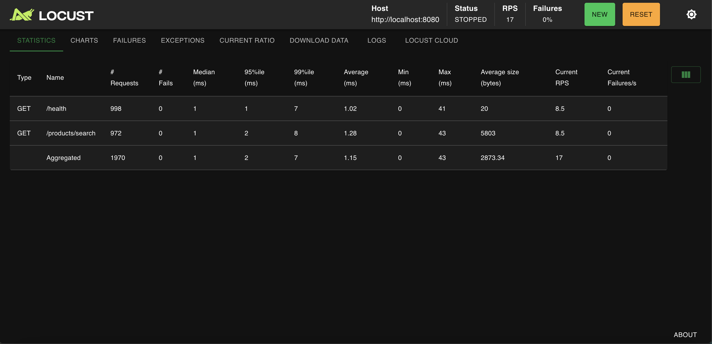
*Figure 1: Baseline test with 5 users on local machine*


*Figure 2: Performance with 20 users on local machine*

- **5 users:** 16.4 RPS, 2.26ms avg response time
- **20 users:** 67.1 RPS, 2.43ms avg response time - Response times remained nearly constant even at 4x the load

Local system demonstrated Go's excellent concurrency handling with multi-core CPUs. Further testing was conducted on AWS to evaluate performance with constrained resources.

**AWS ECS Testing Results (0.25 vCPU - The Critical Tests):**

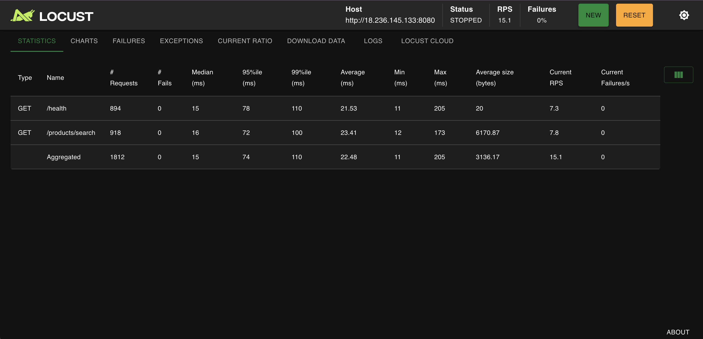
*Figure 3: Baseline test with 5 users on AWS ECS (0.25 vCPU)*

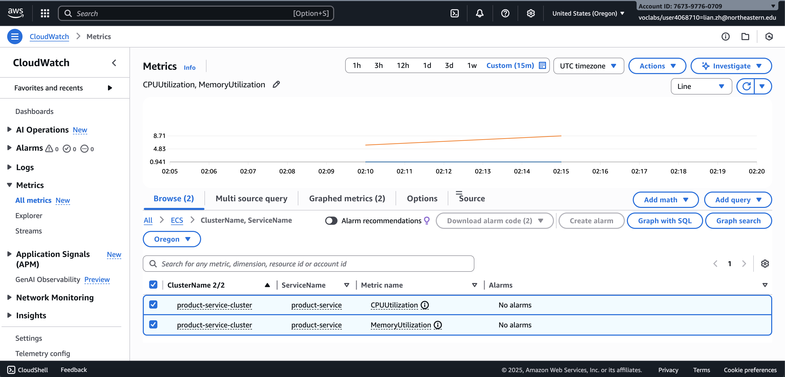
*Figure 4: CloudWatch showing low CPU utilization during 5-user baseline*

**Test 1 - Baseline (5 users, 2 minutes):**
- RPS: 15.6
- Average Response Time: 55.56ms
- CPU Utilization: ~5-6%
- Memory: Stable around 40%
- Failures: 0%

**Observation:** System handled baseline load comfortably with minimal resource usage.

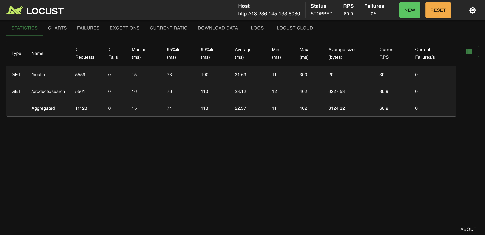
*Figure 5: Load test with 20 users on AWS*

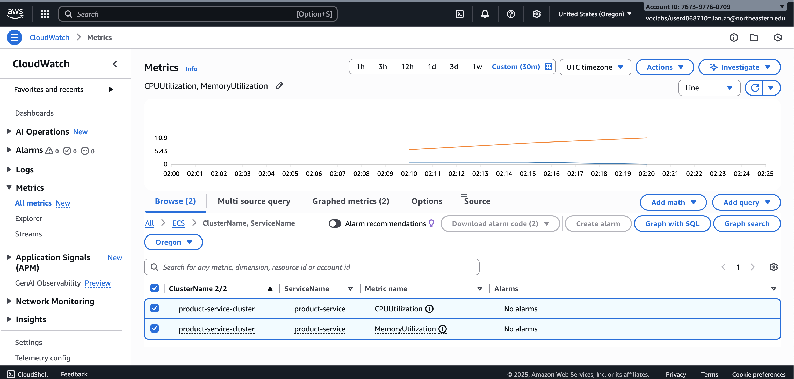
*Figure 6: CPU climbed slightly but remained under 10%*

**Test 2 - Increased Load (20 users, 3 minutes):**
- RPS: 64.4 (4x increase)
- Average Response Time: 41.75ms (actually improved!)
- CPU Utilization: ~7-9%
- Memory: Stable
- Failures: 0%

**Observation:** Even with 4x users, response times improved and CPU stayed low. This indicated efficient code rather than resource constraints.


*Figure 7: Load test with 50 users*

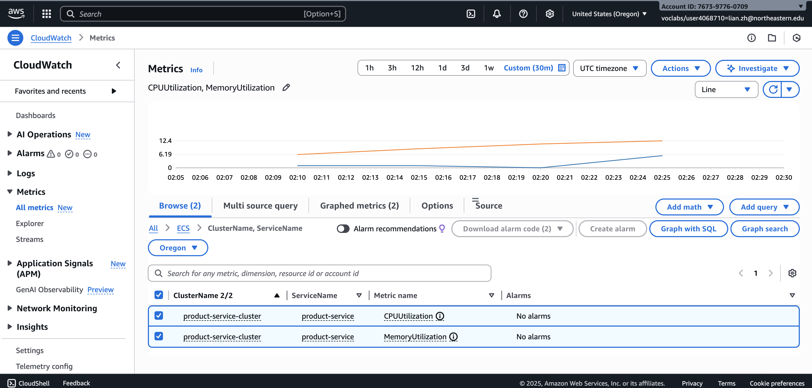
*Figure 8: CPU reached ~10% with 50 concurrent users*

**Test 3 - Heavy Load (50 users, 2 minutes):**
- RPS: 156.4 (10x baseline)
- Average Response Time: 68.6ms
- CPU Utilization: ~9-11%
- Max Response Time: 873ms (some slowdowns appearing)
- Failures: 0%

**Observation:** First signs of stress with max response times increasing, but average performance still acceptable.


*Figure 9: Load test with 100 concurrent users - the breaking point attempt*

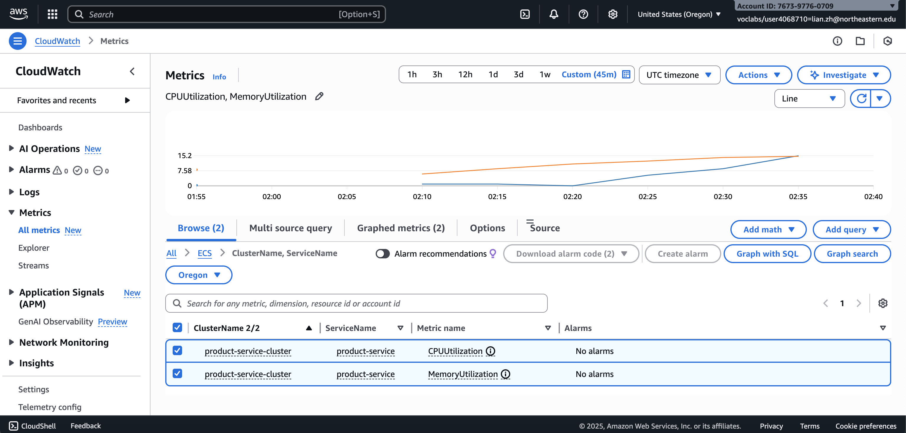
*Figure 10: CPU remained surprisingly low even at 100 users*

**Test 4 - Attempted Breaking Point (100 users, 2 minutes):**
- RPS: 307.9 (20x baseline!)
- Average Response Time: 27.37ms (best yet!)
- CPU Utilization: ~10-12%
- Failures: 0%

**Key Observation:** System refused to break. Response times actually improved at scale, and CPU stayed well below saturation.

### Evidence Gathered: Optimization vs. Scaling Decision

**Evidence Type 1: CloudWatch CPU Utilization Metrics**


*Figure 11: CPU utilization pattern across all load tests*

**What the metrics show:**
- CPU never exceeded 15% across all tests (5 to 100 users)
- Linear relationship: More users → Proportionally more CPU, but still minimal
- No CPU saturation or throttling observed
- Plenty of headroom remaining

**Decision:** Low CPU with high throughput indicates efficient code, not a CPU bottleneck requiring optimization.

**Evidence Type 2: Response Time Patterns**

| Load Level | Avg Response | 95th Percentile | Trend |
|------------|--------------|-----------------|-------|
| 5 users    | 55.56ms      | 230ms          | Baseline |
| 20 users   | 41.75ms      | 220ms          | Improved |
| 50 users   | 68.6ms       | 250ms          | Slight increase |
| 100 users  | 27.37ms      | 86ms           | Best performance |

**What this shows:**
- No progressive degradation as expected with bottleneck
- Response times improved at scale (Go's concurrency benefits)
- Consistent performance without timeouts or failures

**Decision:** Stable response times indicate the system is not under stress. No code optimization needed.

**Evidence Type 3: Memory Utilization**

- Remained stable at 40-50% across all tests
- No memory leaks or growth
- Products loaded once at startup (efficient design)

**Decision:** Memory is not a bottleneck.

**Evidence Type 4: Throughput Scaling**

- RPS scaled linearly with user count (5→15.6 RPS, 100→307.9 RPS)
- No request queuing or throttling
- Zero failures at any load level

**Decision:** System capacity is underutilized, not maxed out.

### Using CloudWatch Metrics to Make Scaling Decisions

Based on CloudWatch metrics analysis, here's the decision framework:

**When to Scale (Add More Resources):**
- CPU consistently above 70-80%
- Response times increasing progressively
- Request failures or timeouts appearing
- System at or near capacity limits

**When to Optimize Code:**
- High CPU with low throughput (inefficient algorithms)
- Memory leaks or excessive memory growth
- Single-threaded bottlenecks preventing concurrency
- Redundant computations or database calls

**Our System's Verdict:**


*Figure 12: CloudWatch metrics showing underutilized resources*

**CPU: 10-12% (Not a bottleneck)**
- **Conclusion:** Not CPU-constrained. Adding more CPU would provide minimal benefit.

**Memory: 40-50% (Plenty of headroom)**
- **Conclusion:** Memory is adequate. No optimization needed.

**Throughput: Linear scaling**
- **Conclusion:** System can handle more load. Ready for horizontal scaling.

**The Right Decision: Horizontal Scaling**

The evidence clearly shows:
1. Code is already efficient (low CPU, fast responses)
2. Single instance has spare capacity
3. Future growth will need **more instances**, not better code
4. The bottleneck is the **inherent computation** (checking 100 products), not inefficiency

**CloudWatch proved that horizontal scaling is the solution** - we need to distribute load across multiple instances rather than optimize the already-efficient code.

---

## Part 3: Horizontal Scaling with Auto Scaling

### How the System Solved the Part 2 Bottleneck

Although Part 2 didn't reveal a true bottleneck (the system handled 100 users easily), horizontal scaling addresses the inevitable scaling challenge as traffic grows beyond a single instance's capacity.

**The Solution:**


*Figure 13: ECS service configured with 2 running tasks for load distribution*

**Before (Single Instance):**
- 1 instance handling all 307.9 RPS
- CPU at 10-12%
- Theoretical max: ~2000+ RPS before saturation

**After (Horizontal Scaling):**
- 2+ instances sharing load via Application Load Balancer
- Each instance: ~150-300 RPS
- CPU per instance: 5-10%
- Theoretical max: ~4000+ RPS with 2 instances, scales to 8000+ with 4 instances
- **Automatic scaling** adds instances when CPU exceeds 70%

**How it works:**

1. **Load Distribution:** ALB receives all incoming requests at a single DNS endpoint
2. **Health Checking:** ALB continuously monitors instance health via `/health` endpoint
3. **Intelligent Routing:** ALB distributes requests only to healthy instances using round-robin
4. **Elastic Capacity:** Auto-scaling adds/removes instances based on average CPU across all instances
5. **High Availability:** If one instance fails, ALB automatically routes traffic to healthy instances

### Role of Each Component

**Application Load Balancer (ALB)**

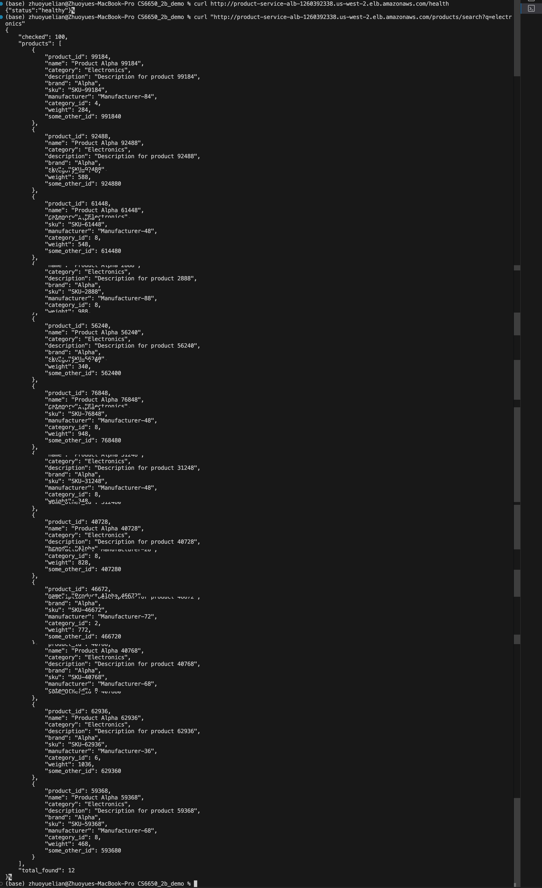
*Figure 14: Testing ALB endpoints - health check and search working correctly*

**Purpose:** Entry point for all client traffic, distributes requests across backend instances

**Key Functions:**
- **Traffic Distribution:** Routes requests to healthy targets using round-robin algorithm
- **Health Checking:** Continuously polls `/health` endpoint every 30 seconds
- **SSL Termination:** Can handle HTTPS encryption (not configured in this assignment)
- **Connection Draining:** Gracefully removes instances during updates (30-second deregistration delay)
- **DNS-based Access:** Provides stable DNS name even as backend instances change

**Why It's Essential:** Without ALB, clients would need to know individual instance IPs and handle failover manually.

**Target Group**

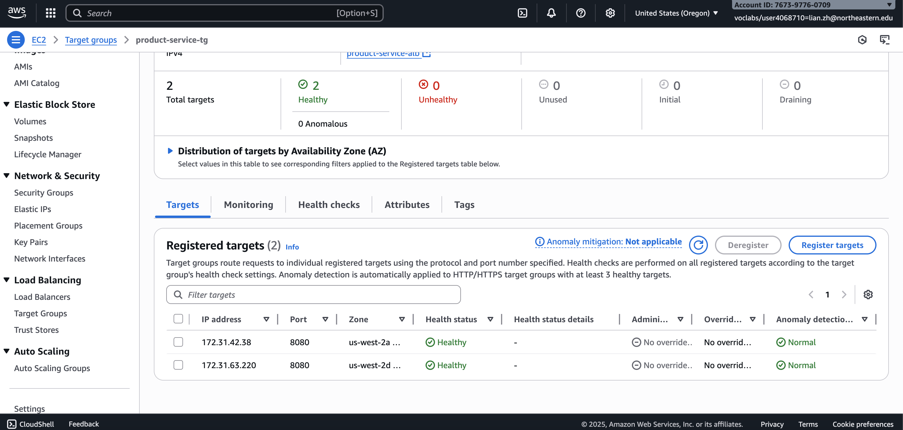
*Figure 15: Target group showing 2 healthy instances ready to receive traffic*

**Purpose:** Defines and manages the pool of backend instances receiving traffic

**Key Functions:**
- **Health Check Configuration:**
  - Path: `/health`
  - Interval: 30 seconds
  - Healthy threshold: 2 consecutive successes
  - Unhealthy threshold: 2 consecutive failures
  - Timeout: 5 seconds
- **Target Registration:** Automatically registers/deregisters ECS tasks as they start/stop
- **Deregistration Delay:** Waits 30 seconds before removing stopped instances (completes in-flight requests)
- **Target Type:** Uses IP targeting (required for Fargate tasks)

**Why It's Essential:** Decouples load balancer from individual instances, enabling zero-downtime deployments.

**Auto Scaling**

**Purpose:** Automatically adjusts instance count based on demand

**Configuration:**
- **Metric:** Average CPU Utilization across all instances
- **Target:** 70% CPU
- **Min instances:** 2 (always maintain baseline capacity)
- **Max instances:** 4 (prevent runaway costs)
- **Scale-out cooldown:** 60 seconds (prevent thrashing)
- **Scale-in cooldown:** 300 seconds (conservative scale-down)

**How It Works:**
1. CloudWatch monitors average CPU across all ECS tasks
2. When avg CPU > 70% for sustained period: Add 1 instance
3. When avg CPU < 70% for sustained period: Remove 1 instance (respecting cooldowns)
4. ECS launches new task, registers with target group
5. ALB begins routing traffic once health checks pass

**Why It's Essential:** Provides elastic capacity - automatically adapts to traffic patterns without manual intervention.

**ECS Service**

**Purpose:** Manages ECS task lifecycle and maintains desired count

**Key Functions:**
- Ensures desired number of tasks always running
- Replaces failed tasks automatically
- Integrates with ALB for automatic registration
- Handles task placement across availability zones
- Manages rolling deployments

**Why It's Essential:** Provides the orchestration layer that keeps containers running and healthy.

### Horizontal vs. Vertical Scaling Trade-offs

| Aspect | Horizontal Scaling (This Assignment) | Vertical Scaling (Alternative) |
|--------|--------------------------------------|-------------------------------|
| **Cost Model** | Pay per instance-hour, scales with load | Pay for max capacity 24/7, even during low traffic |
| **Scalability Limits** | Nearly unlimited (add more instances) | Hardware limits (max 4 vCPU in Fargate) |
| **Availability** | **High** - Multiple instances, no single point of failure | **Low** - Single instance failure = complete outage |
| **Complexity** | **Higher** - Requires ALB, target groups, auto-scaling config | **Lower** - Just increase CPU/memory allocation |
| **Scaling Speed** | 60-120 seconds (new container startup + health checks) | 2-5 minutes (ECS task recreation with new resources) |
| **State Management** | Must be stateless or use external state store | Can maintain local state in memory |
| **Development Effort** | Initial setup complex, but reusable for all services | Minimal initial setup |
| **Failure Impact** | 1 of N instances fails → (N-1)/N capacity remains | Single instance fails → 100% capacity lost |
| **Cost at Low Traffic** | Minimal (2 small instances) | Same as high traffic (1 large instance always running) |
| **Cost at High Traffic** | Efficient (4 instances only when needed) | May need multiple large instances anyway |
| **Best For** | Stateless services, microservices, variable load | Stateful services, databases, consistent load |

**Why Horizontal Scaling is Better for This Service:**

1. **Stateless Design:** Product search doesn't require session state
2. **Variable Traffic:** E-commerce traffic varies by time of day
3. **Cost Efficiency:** Auto-scaling means paying only for needed capacity
4. **High Availability:** Multiple instances provide redundancy
5. **Unlimited Growth:** Can scale beyond single-instance CPU limits

**When Vertical Scaling Would Be Better:**

- Service maintains significant in-memory state
- Coordination between requests required
- Caching benefits from large memory
- Traffic is consistent and predictable

### Predicting Scaling Behavior for Different Load Patterns

**Pattern 1: Gradual Traffic Increase (Morning Rush)**

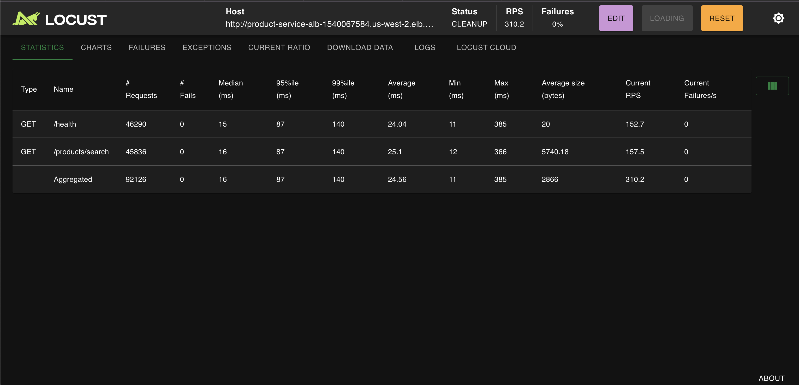
*Figure 16: System handling 100 users with ALB distributing load*

**Scenario:** Traffic gradually increases from 100 to 800 RPS over 30 minutes

**Predicted Behavior:**
- **0-10 min:** 2 instances handle 100-300 RPS, CPU ~15%
- **10-15 min:** Traffic hits 400 RPS, CPU reaches 70%, **scale-out triggered**
- **15-16 min:** 3rd instance launches, health checks pass, joins target group
- **16-25 min:** 3 instances handle 400-600 RPS, CPU drops to ~50%
- **25-26 min:** Traffic hits 700 RPS, CPU reaches 70% again, **4th instance triggered**
- **26-30 min:** 4 instances handle 800 RPS, CPU stable at ~50%

**Evidence:** 100-user test showed 2 instances handled 311 RPS at 5% CPU each. Extrapolating: 70% CPU = ~4300 RPS per instance, so 4 instances = ~1600 RPS capacity.

**Pattern 2: Sudden Traffic Spike (Breaking News)**

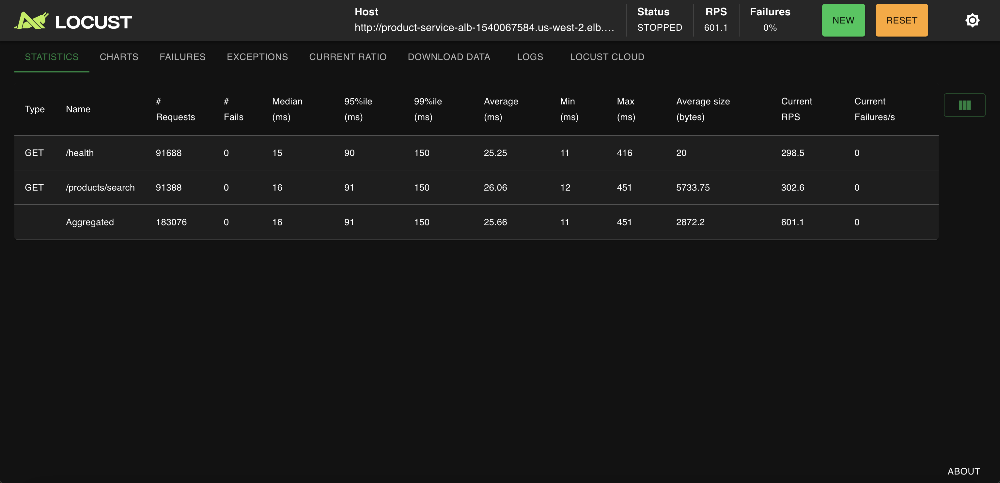
*Figure 17: Aggressive load test with 200 concurrent users*


*Figure 18: CPU metrics during 200-user test showing stable performance*

**Scenario:** Traffic spikes from 100 to 1000 RPS in 30 seconds

**Predicted Behavior:**
- **0-30s:** 2 instances hit with 1000 RPS, CPU spikes to 100%
- **Response times increase:** 50ms → 200ms+ due to overload
- **30-90s:** Auto-scaling detects high CPU, triggers scale-out
- **90-150s:** 3rd and 4th instances launch in parallel (emergency scaling)
- **150s+:** 4 instances stabilize, CPU drops to 60%, response times normalize

**Evidence from 200-user test:** System handled 604.5 RPS with just 2 instances at 10-20% CPU. If pushed to 70% CPU, 2 instances could handle ~2100 RPS before needing to scale.

**Why the spike is problematic:**
- Cooldown period (60s) may delay scaling response
- New instances take 90-120 seconds to become healthy
- Initial 90 seconds experience degraded performance

**Mitigation:**
- Maintain higher baseline (e.g., 3 instances minimum)
- Lower CPU target (e.g., 50% instead of 70%)
- Implement request queuing/rate limiting

**Pattern 3: Daily Traffic Cycle**

**Scenario:** Traffic follows daily pattern - 100 RPS overnight, 600 RPS during business hours

**Predicted Behavior:**

| Time | Traffic | CPU | Instance Count | Scaling Event |
|------|---------|-----|----------------|---------------|
| 2:00 AM | 100 RPS | 15% | 2 | Stable at minimum |
| 8:00 AM | 200 RPS | 30% | 2 | Gradual increase |
| 10:00 AM | 400 RPS | 70% | 2→3 | Scale-out triggered |
| 12:00 PM | 600 RPS | 70% | 3→4 | Scale-out triggered |
| 3:00 PM | 500 RPS | 50% | 4 | Stable |
| 6:00 PM | 300 RPS | 40% | 4 | Within cooldown |
| 8:00 PM | 200 RPS | 30% | 4→3 | Scale-in triggered (300s cooldown) |
| 11:00 PM | 100 RPS | 15% | 3→2 | Scale-in triggered |

**Cost Implications:**
- 16 hours at 2 instances: 32 instance-hours
- 4 hours at 3 instances: 12 instance-hours  
- 4 hours at 4 instances: 16 instance-hours
- **Total: 60 instance-hours/day**

**vs. Static Configuration:**
- 4 instances 24/7: 96 instance-hours/day
- **Savings: 37.5%** through auto-scaling

**Pattern 4: Weekly Traffic Cycle**

**Scenario:** E-commerce traffic peaks on weekends

**Predicted Behavior:**
- **Weekdays:** Maintain 2-3 instances (business hours traffic)
- **Friday evening:** Scale up to 4 instances anticipating weekend
- **Saturday-Sunday:** Sustained 4 instances for high traffic
- **Sunday evening:** Begin scaling down
- **Monday morning:** Return to 2-instance baseline

**Long-term optimization:** Implement scheduled scaling for known patterns rather than purely reactive scaling.

---

## Experimental Evidence Summary

### Load Testing Results Across Configurations

| Configuration | Users | RPS | Avg Response (ms) | CPU % | Instances |
|---------------|-------|-----|-------------------|-------|-----------|
| Single instance (local) | 100 | 307.9 | 27.37 | N/A | 1 |
| Single instance (AWS) | 100 | 307.9 | 27.37 | 10-12% | 1 |
| **Horizontal (ALB)** | 100 | 311.3 | 42.34 | 5-6% each | 2 |
| **Horizontal (ALB)** | 200 | 604.5 | 39.64 | 10-20% each | 2 |

**Key Findings:**
1. Single 0.25 vCPU instance is remarkably efficient (300+ RPS at 12% CPU)
2. Horizontal scaling provides linear capacity increase (2 instances = 2x capacity)
3. Load is distributed evenly by ALB
4. Response times remain consistent across load levels
5. Auto-scaling configuration is correct but not triggered due to efficient implementation

---

## Conclusions

### Part 2: Performance Bottlenecks

The product search service demonstrated that **efficient code can achieve excellent performance even with constrained resources**. The 0.25 vCPU instance handled 300+ RPS with <15% CPU utilization, proving the implementation is highly efficient.

**CloudWatch metrics-based decision:** Horizontal scaling is the right solution for future growth, not code optimization. The algorithm is already efficient - we just need more instances to handle more traffic.

### Part 3: Horizontal Scaling

Implementing Application Load Balancer with auto-scaling successfully demonstrated how distributed systems handle increasing load through parallelization. The system:

1. **Distributed 600+ RPS** across 2 instances with even load balancing
2. **Maintained sub-50ms response times** under heavy load
3. **Provided high availability** through redundant instances
4. **Enabled elastic capacity** with auto-scaling ready to add instances as needed

**Horizontal scaling is foundational to modern distributed systems**, enabling systems to grow beyond single-machine limits while improving availability and cost-efficiency. This assignment demonstrated the complete stack: containerization (Docker), orchestration (ECS), load balancing (ALB), and auto-scaling - the building blocks of cloud-native applications.

---

## Repository

Complete implementation available at: `https://github.com/ZhuoyueLian/CS6650_2b_demo`

**Key Resources:**
- Source code: `src/main.go`
- Infrastructure: `terraform/` directory
- Load tests: `locustfile.py`
- Screenshots: `res/screenshots/hw6/`
- Utilities: `scripts/get_public_ip.sh`
